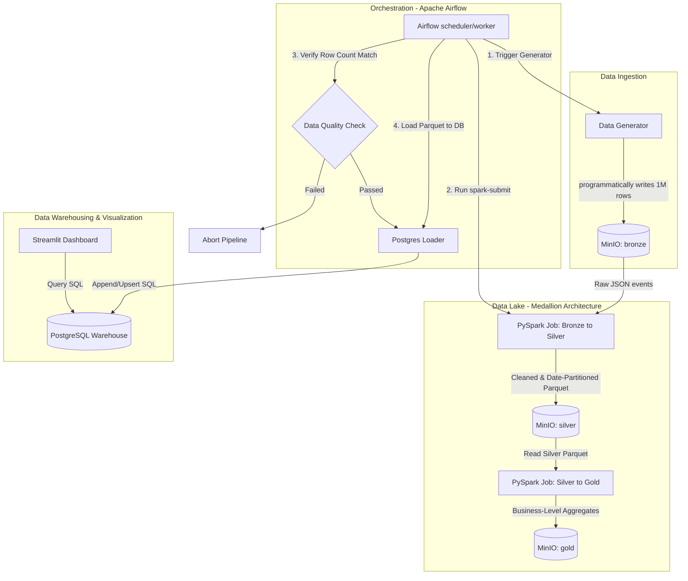

# Batch ETL Pipeline with Spark, Airflow, and MinIO

An end-to-end, containerized batch ETL (Extract, Transform, Load) pipeline demonstrating a modern data stack. The pipeline automates the ingestion of raw e-commerce clickstream events into an S3-compatible object store, processes and aggregates it with Spark (Medallion architecture), validates it using data quality checks, loads it into a PostgreSQL data warehouse, and presents the insights on a premium Streamlit dashboard.

---

## 🏗️ Architecture & Data Flow



1. **Ingestion**: A Python script generates 1,000,000+ synthetic e-commerce event logs (e.g., page views, clicks, purchases, adds-to-cart) and uploads them to the **Bronze** bucket in MinIO as a JSON lines file for the execution date.
2. **Medallion Data Lake (MinIO)**:
   - **Bronze Layer**: Stores raw, unaltered e-commerce events (`events.json`).
   - **Silver Layer**: PySpark cleans the schema, filters invalid rows, casts timestamps, enriches with hour/session IDs, and writes as Parquet files partitioned by date (`year=YYYY/month=MM/day=DD`).
   - **Gold Layer**: PySpark aggregates the cleaned silver records into business metrics (Daily Active Users, Product Sales, Funnel Conversion rates) and writes them as Parquet.
3. **Data Quality Check**: An Airflow task verifies that both Bronze and Silver layers are populated and that the record ratio is within tolerance (>95% match), guaranteeing data integrity before loading.
4. **Data Warehouse (PostgreSQL)**: Gold Parquet files are securely loaded into PostgreSQL tables. The loading mechanism deletes any existing records for the target execution date first, ensuring the pipeline remains fully **idempotent**.
5. **Dashboard (Streamlit)**: A premium dark-themed dashboard connects to PostgreSQL, visualizing DAU trends, purchase funnels, device traffic, and top categories.

---

## 🛠️ Stack Components

The pipeline runs on a single Docker network and exposes these endpoints:

| Service | Host Port | Internal Port | URL |
| :--- | :--- | :--- | :--- |
| **Airflow Webserver** | `8080` | `8080` | [http://localhost:8080](http://localhost:8080) |
| **MinIO Console** | `9001` | `9001` | [http://localhost:9001](http://localhost:9001) |
| **Spark Master UI** | `8081` | `8080` | [http://localhost:8081](http://localhost:8081) |
| **PostgreSQL DB** | `5432` | `5432` | `localhost:5432` |
| **Streamlit Dashboard**| `8501` | `8501` | [http://localhost:8501](http://localhost:8501) |

*Airflow UI Credentials*: Username `admin` / Password `admin`  
*MinIO Credentials*: Access Key `minioadmin` / Secret Key `minioadmin`  
*Postgres Credentials*: User `postgres` / Password `postgres`  

---

## 🚀 Setup & Execution

### Prerequisites
- Docker Desktop running with WSL2 backend (on Windows).
- Python 3.8+ (for local scripts).

### Step 1: Start the Docker Compose Stack
From the project root directory, run:
```bash
docker compose up -d
```
This builds the custom Airflow image (preconfigured with Java 17, matched PySpark 3.5.1, and cloud libraries) and initializes the databases and buckets automatically.

Verify that all services are healthy:
```bash
docker compose ps
```

### Step 2: Trigger the Airflow DAG
To simulate a daily batch run, execute the Airflow CLI command inside the scheduler container to trigger the pipeline for a specific logical date (e.g., `2026-06-19`):
```bash
docker compose exec airflow-scheduler airflow dags trigger -e 2026-06-19 batch_etl_pipeline
```
You can monitor progress in real-time in the Airflow UI at [http://localhost:8080](http://localhost:8080).

### Step 3: Observe Pipeline Outputs

#### 1. Data Lake (MinIO)
Log in to [http://localhost:9001](http://localhost:9001) (`minioadmin` / `minioadmin`) to verify the file outputs:
- **Bronze**: `bronze/year=2026/month=06/day=19/events.json` (Raw NDJSON).
- **Silver**: `silver/year=2026/month=06/day=19/part-xxx.parquet` (Cleaned Parquet).
- **Gold**: `gold/daily_active_users/year=2026/month=06/day=19/` (Aggregates).

#### 2. Data Warehouse (PostgreSQL)
Query the loaded tables directly using `psql` to check rows:
```bash
docker exec -i batch-etl-pipeline-postgres-1 psql -U postgres -d warehouse -c "select * from daily_active_users;"
```

#### 3. Streamlit Dashboard
Open [http://localhost:8501](http://localhost:8501) in your browser. The dashboard automatically pulls data from PostgreSQL and renders charts for:
- Key KPI Cards (DAUs, conversion rates, total revenue).
- User Conversion Funnel (Plotly funnel charts).
- Device share of traffic.
- Top category and product revenue metrics.
- Historical active user trend lines.

---

## 🧠 Design Decisions & Best Practices

1. **Idempotency & Re-runs**:
   - PySpark uses `spark.sql.sources.partitionOverwriteMode = dynamic`. When overwrite is triggered for a specific partition, it overwrites only the corresponding date subdirectory instead of destroying the entire table.
   - The Postgres loader utilizes transaction-bound `DELETE WHERE date = 'YYYY-MM-DD'` commands prior to appending, ensuring repeated executions do not duplicate data.
2. **Metadata-Based Quality Checks**:
   - The data quality task retrieves raw Bronze counts by reading the uploaded JSON file line-by-line in a streaming fashion. It retrieves Silver counts by scanning Parquet fragment metadata directly from MinIO, taking only milliseconds and conserving JVM memory.
3. **Matched PySpark Environments**:
   - Standard PySpark drivers and Spark master/workers must run identical major/minor versions to allow successful task serialization. The Airflow container is built with `pyspark==3.5.1` to match the `3.5.1` cluster containers, preventing `serialVersionUID` class mismatches.
4. **Secure Connection Management**:
   - Instead of hardcoding credentials, the Airflow Scheduler automatically registers MinIO (S3) and Postgres connection strings via environment variables (`AIRFLOW_CONN_...`), allowing the hooks to look up parameters dynamically.
